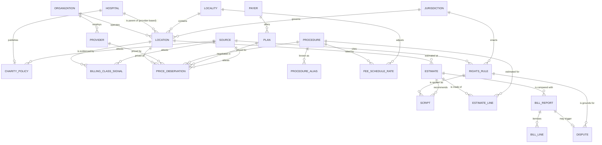

# anarmandaleg — data model

Design document. Nothing is built. This is what an implementer should build
from, and the reasoning is included because the reasoning is the part that is
expensive to reconstruct.

---

## 1. The shape of the problem

Three questions, and they need different data:

| Question | Needs |
|---|---|
| What will this cost me here? | procedure + place + price observations |
| Will this address ambush me? | place + billing class, with evidence |
| What do I say to them? | jurisdiction + rights rules + scripts |

The third one is what makes this different from a price lookup, and it is the
part with legal teeth. It is modelled as data, not written as copy, because
rules differ by state, change by statute, and must each carry a citation.

---

## 2. Diagram

---

## 3. Entities

### The world as it is

**ORGANIZATION** — a practice, group or health system.
`id, name, tin, type (independent | system_owned | hospital | public), parent_org_id, npi_org`

**HOSPITAL** — an organisation with a CMS Certification Number, which is what
makes charity care obligations and price-transparency files attach to it.
`id, org_id, ccn, ownership (nonprofit | for_profit | government), price_file_url, price_file_fetched_at`

**PROVIDER** — a human clinician.
`id, npi, name, primary_specialty, accepts_self_pay (nullable)`

**LOCATION** — an address where care happens. **The unit that decides the
price.** Two locations of one organisation can bill differently.
`id, org_id, parent_hospital_id (nullable), address, geo, locality_id, jurisdiction_id, billing_class (independent_office | hospital_outpatient_dept | asc | unknown), billing_class_confidence, billing_class_as_of`

> `billing_class` is the single most valuable field in the model and the hardest
> to get right. It is never asserted from one source — see BILLING_CLASS_SIGNAL.

**LOCALITY** — Medicare's geographic adjustment area. The floor is local.
`id, mac, locality_code, state, gpci_work, gpci_pe, gpci_mp`

**JURISDICTION** — federal, state, sometimes county. Rights differ.
`id, level (federal | state | county), code, name`

### What things cost

**PROCEDURE** — what is being bought.
`id, code_system (cpt | hcpcs | drg | ccsr), code, short_name, plain_name, typical_setting, requires_imaging_guidance (bool)`

**PROCEDURE_ALIAS** — what a frightened person actually types. "cortisone
shot", "knee injection", "steroid shot in knee" all resolve to 20610.
`id, procedure_id, text, weight`

**FEE_SCHEDULE_RATE** — the Medicare floor, by locality and setting.
`id, procedure_id, locality_id, setting (facility | non_facility), amount, year`

**PAYER**, **PLAN** — for negotiated rates out of Transparency in Coverage files.
`payer: id, name, hios_issuer_id` · `plan: id, payer_id, name, market, ein`

**PRICE_OBSERVATION** — **the core table, and it is evidence, not truth.**
`id, procedure_id, location_id, provider_id (nullable), plan_id (nullable), price_type (medicare_floor | gross_charge | discounted_cash | prompt_pay | negotiated | user_reported), amount, currency, includes (json: procedure | drug | visit | facility_fee), counts_toward_deductible (bool, nullable), source_id, observed_at, effective_from, effective_to, confidence`

> `prompt_pay` is a distinct type from `discounted_cash`: a pay-today discount is
> a different offer from a published cash price, is usually verbal, and is
> therefore usually only learned from a user report.
>
> `counts_toward_deductible` is why a cheaper price can be the worse choice, and
> it must travel with the number rather than live in a footnote. See BUILD.md
> §2a.

> Two observations may contradict each other and both are kept. A published
> cash price and three user-reported bills that are double it is the most
> useful thing this database can contain, and averaging it away destroys the
> finding. The estimator reads observations; it does not overwrite them.

### Why the same thing costs more here

**BILLING_CLASS_SIGNAL** — the evidence that an address does or does not bill as
a hospital outpatient department. Facility fees are the wedge, so the
conclusion must be auditable.
`id, location_id, signal_type (cms_provider_based_list | pos_code_on_claim | price_file_presence | hospital_website_listing | user_reported_bill | state_disclosure_registry), value, source_id, observed_at, weight`

### What you can make them do

**RIGHTS_RULE** — a legal lever, as data.
`id, jurisdiction_id, name, citation, applies_when (json predicate: self_pay, uninsured, scheduled_days_ahead, hospital_nonprofit, income_fpl_below...), obligation, deadline_days, threshold_amount, penalty_or_remedy, effective_from, source_id`

Seed rows, all verified 2026-09-11:

| name | citation | key terms |
|---|---|---|
| Good Faith Estimate | 45 CFR 149.610 | self-pay or uninsured; written, itemised, with codes and NPIs; 1 business day if scheduled 3+ days out, 3 business days if 10+ days out or on request |
| Patient-provider dispute resolution | No Surprises Act | final bill ≥ $400 over the GFE; third-party reviewer; binding on provider |
| CA Hospital Fair Pricing | Health & Safety Code 127400 et seq. | non-profit; free care under 200% FPL, sliding scale 200–400%; written notice required; HCAI publishes policies |
| 501(r) financial assistance | 26 USC 501(r) | non-profit hospitals must have and publicise a financial assistance policy |
| Restriction on disclosure to a health plan | 45 CFR 164.522(a)(1)(vi) | provider **must** agree when the individual paid in full out of pocket and the disclosure is for payment or operations; covers only that item or service; does not apply where law requires the claim; some in-network contracts constrain the provider |

> The last row is the one that makes self-pay a *right* rather than a favour, and
> it is the least known. `applies_when` carries the two conditions (paid in full;
> disclosure is for payment or operations) and `obligation` is **mandatory
> agreement**, which distinguishes it from the ordinary restriction request in
> 164.522(a)(1)(i) that a provider may simply decline.

**SCRIPT** — the incantation itself: what to say, to whom, and what it triggers.
`id, rights_rule_id, channel (phone | in_person | portal | letter), audience (scheduler | billing | registration), text, expected_response, if_refused, reading_level`

> Written to be read aloud by someone who is frightened. Short sentences, no
> legalese in the spoken part, the citation kept in a footnote for when they are
> told no.

**CHARITY_POLICY** — one hospital's actual policy.
`id, hospital_id, free_care_fpl_max, sliding_scale_fpl_max, application_url, presumptive_eligibility (json: CalFresh, WIC, LIHEAP...), covers_provider_based_locations (bool, nullable), application_deadline_days_after_service, source_id, as_of`

> `covers_provider_based_locations` is the field that turns a warning into a
> remedy. When a LOCATION's `billing_class` is `hospital_outpatient_dept`, its
> parent hospital's policy may apply to that bill — so the same fact that
> explains the facility fee may also forgive part of it. Nullable because many
> policies are silent on it, and silence must read as *ask them*, never as no.
>
> `application_deadline_days_after_service` matters because assistance is often
> still available **after** a bill arrives, and people assume it is too late.

### What the user gets, and gives back

**ESTIMATE** — one answer to one question. Kept so a later bill can be compared
against it, which is the $400 rule's whole mechanism.
`id, session_token, location_id, procedure_ids, created_at, low, expected, high, facility_fee_expected (bool), basis (json: which observations were used)`

**ESTIMATE_LINE** — the itemisation the user can hand back to the office.
`id, estimate_id, procedure_id, price_type_used, amount, note`

**BILL_REPORT** — what they were actually charged, submitted voluntarily,
**de-identified on ingest**. This is the flywheel: it corrects the model and it
detects disputes.
`id, estimate_id (nullable), location_id, procedure_ids, total_billed, facility_fee_present (bool), facility_fee_amount, service_date_month (month precision only), source (on_device_extraction | manual_entry), created_at`

> There is no `upload` source and no image entity anywhere in this model. The
> photograph never leaves the phone — see §4a, which is a design decision rather
> than a policy, because a policy can be changed by whoever runs the server.

**BILL_LINE** — `id, bill_report_id, code, description, amount`

**DISPUTE** — `id, bill_report_id, rights_rule_id, kind (gfe_400 | balance_billing | charity_care_denied), status, filed_at, outcome, amount_recovered`

**SOURCE** — provenance for everything above.
`id, kind (cms_file | payer_mrf | statute | hospital_site | state_registry | user), url, retrieved_at, hash, notes`

---

## 4. Rules that keep it honest

1. **Nothing is stored without a SOURCE.** A price with no provenance is a
   rumour, and rumours are what this tool exists to replace.
2. **Observations are append-only.** Corrections arrive as new observations with
   later dates; nothing is edited in place. The history of a price is itself
   evidence when disputing a bill.
3. **`billing_class` is derived, never entered.** It is computed from weighted
   signals and always displayed with its date and its reasoning. "Probably a
   hospital outpatient department, because the hospital's own provider-based
   list named this address in June" is an honest answer; a bare badge is not.
4. **No PHI, no accounts.** A session token, not a person. Bill reports are
   de-identified at ingest and dated to the month. Nobody should have to
   register to find out what a knee injection costs.
5. **Absence is a value.** No published cash price is a finding worth showing,
   not a blank. The map of who refuses to publish is part of the product.

   Record non-disclosure explicitly rather than leaving a null: a `SOURCE` row
   for the file that was fetched and did not contain the procedure, so "they do
   not publish this" is a dated, sourced claim we can stand behind rather than
   an absence we merely observed. Institutions are required to publish much of
   this; the ones that do not are the story. See BUILD.md §9a.
6. **Money is integer cents.** Never floats.

---

## 4a. Bill photographs: the image never arrives

**Decided.** A photographed bill is the richest input we could have and the
worst thing we could hold. So the server never receives one.

**The rule: you cannot leak, subpoena, or breach what you never received.**
Every other protection — encryption at rest, short retention, tight access
control — is a promise about custody. This is the only design that needs no
promise, and it is the only one that survives an insider, a warrant and a
misconfigured bucket without changing its answer: *we do not have it.*

### How it works

1. **The photograph stays on the phone.** Text extraction runs in the browser
   (WASM OCR), on-device. No upload, no third-party OCR API — sending a medical
   bill to someone else's vision endpoint is the exact harm being avoided, just
   with a different logo on it.
2. **Extraction is a WHITELIST, not a redaction.** We do not receive a bill and
   remove the personal parts; we pull only these fields and discard the rest by
   construction:

   | Kept | Why |
   |---|---|
   | facility / practice name | resolves to a LOCATION |
   | service line codes (CPT/HCPCS/rev) | resolves to a PROCEDURE |
   | charge amount per line | the PRICE_OBSERVATION |
   | whether a facility fee line is present, and its amount | the wedge |
   | service month and year | effective dating |
   | payer name (optional) | plan-level context |

   Never extracted, never transmitted: patient name, address, date of birth,
   member or MRN or account number, guarantor, diagnosis codes, provider notes.
   **Diagnosis codes are excluded on purpose** — they are the difference between
   a price report and a medical record.
3. **The user sees exactly what will be sent**, as editable fields, before
   anything leaves the device. Confirmation is both consent and quality control:
   on-device OCR is less accurate than a server GPU, and a human correcting six
   fields fixes that while proving they agreed to each one.
4. **What is transmitted is JSON**, becoming a BILL_REPORT. It is dated to the
   month, carries no session-to-identity link, and stores no IP address.
5. **Keeping their own copy is local-only.** If someone wants the image kept, it
   goes in browser storage on their device, never synced. Their phone already
   holds their medical bills; that is not our risk to take on.

### Consequences that must not be quietly dropped

- **No `BILL_IMAGE` entity exists anywhere in this model, and none should be
  added.** If a future feature seems to need one, it is a different product.
- `BILL_REPORT.source` is therefore `on_device_extraction | manual_entry`. There
  is no `upload` value.
- **EXIF never matters**, because the file never moves. (If any image path is
  ever built anyway, strip EXIF first — a bill photo carries GPS.)
- **Abuse prevention cannot fingerprint.** Rate limiting has to work without
  identifying the submitter: hashed short-TTL buckets or proof-of-work, not
  device fingerprints. A tool for frightened people must not build a tracking
  system to protect itself.
- **Manual entry stays a first-class path.** Some bills will not OCR, some
  people will not grant camera access, and neither should be a dead end.

---

## 5. Open questions for a human
- **Scope of v1.** Proposal: one state (California), the 50 procedures people
  actually shop for, and the federal rights. National is a data problem, not a
  design problem, and can wait.
- **Provider-level pricing.** Do we ever name an individual doctor's prices, or
  only locations and organisations? Naming humans invites fights the data may
  not survive.
- **Payer MRF ingest.** The Transparency in Coverage files are enormous. Ingest
  on demand for a queried procedure, rather than warehousing everything?
- **Who is liable for a wrong number?** The estimate must read as an estimate,
  and the disclaimer is a design element, not a legal afterthought.
